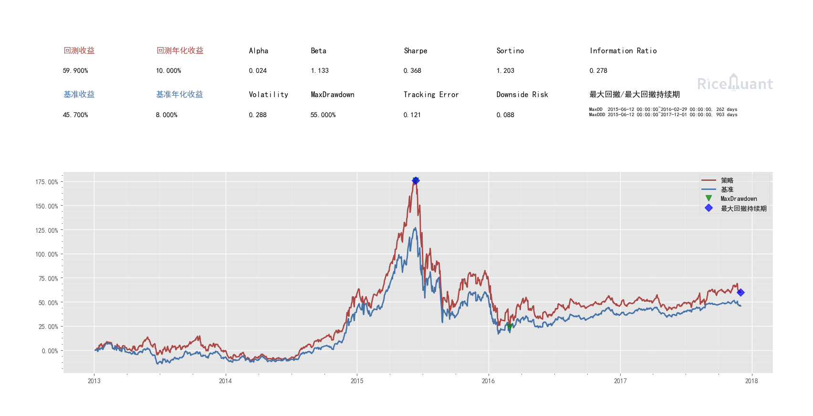
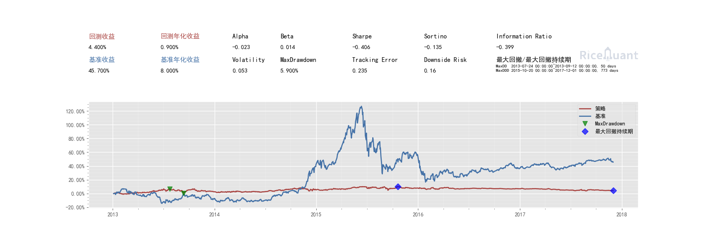
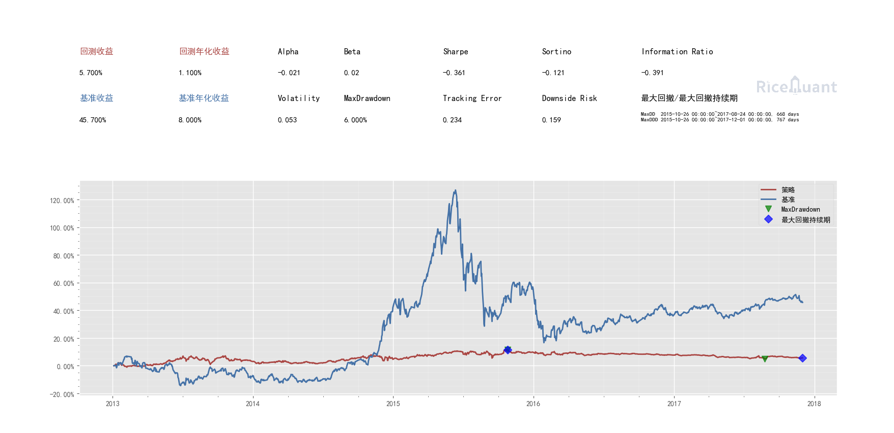

## 说明

主文件btest.py 当在自己电脑上安装好米筐后就能运行，米筐安装方法参见：<a href="http://rqalpha.readthedocs.io/zh_CN/latest/index.htmlhttp://rqalpha.readthedocs.io/zh_CN/latest/index.html">RQAlpha 3.0.x Documentation</a>.

回测采用远程调用服务器端接口方法的方式，
`from xmlrpc.client import ServerProxy;_RPC = ServerProxy("http://node0:8898")`
我电脑上host中设置了node0对应了服务器的ip，所以需要修改成相应ip。该远程接口暴露了方法`getTradeStocks('2013-07-03','m')` 第一个参数是时间，第二个是周期。 接口服务器端位置在`screen -r XMLRPC` 如果接口更改应该重启该服务，里面的代码也简单，可以修改增添接口等。

运行btest.py回测便开始了，可以看到一些输出。最终会出回测结果图，回测相应的调节可以调节config.py文件，如果不明白一些参数，可以参看cfg.yml 文件。回测结束后会生成日志记录文件在results文件夹中，回测结果分析方法参见：<a href="http://rqalpha.readthedocs.io/zh_CN/latest/intro/optimizing_parameters.html#id4">批量回测分析</a>

### 一些回测结果图
原始未对冲股指期货的

对冲股指期货的

选股端更改factor number后取得一些进展

